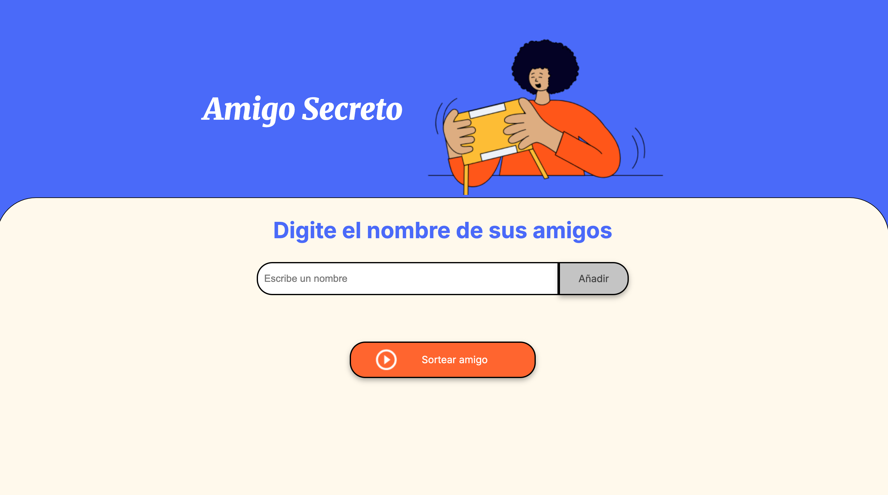
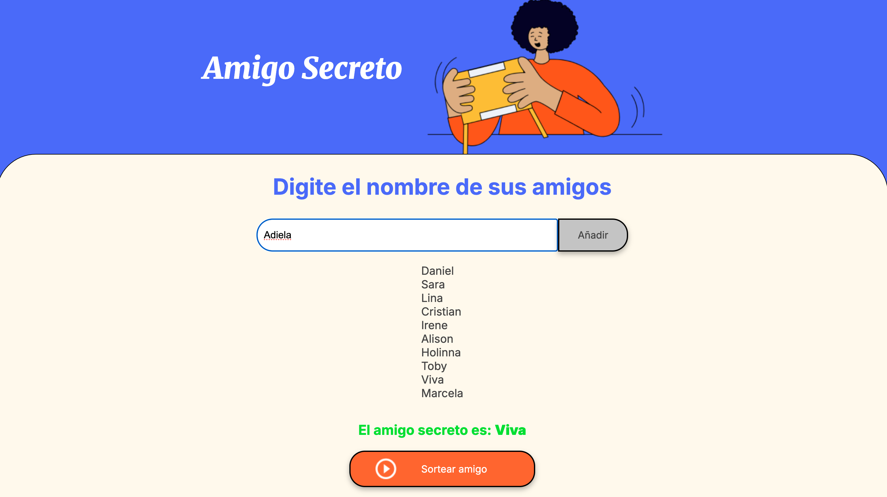
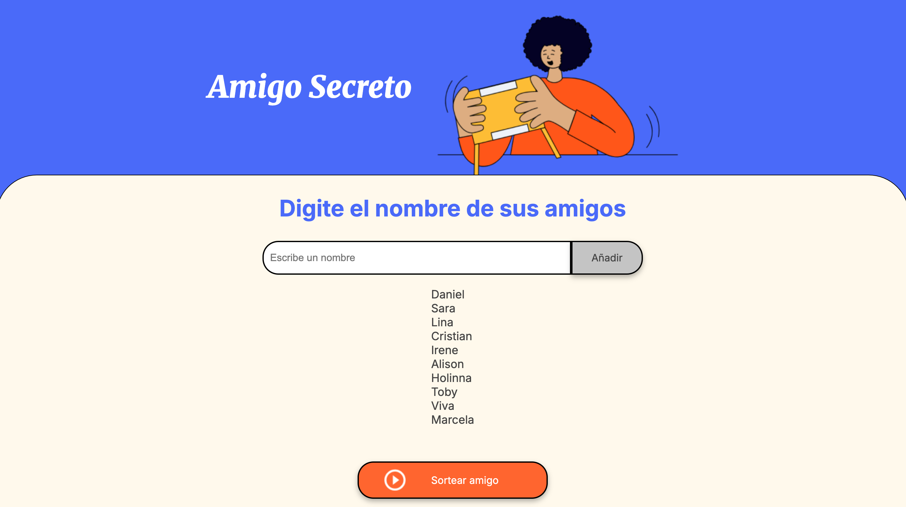
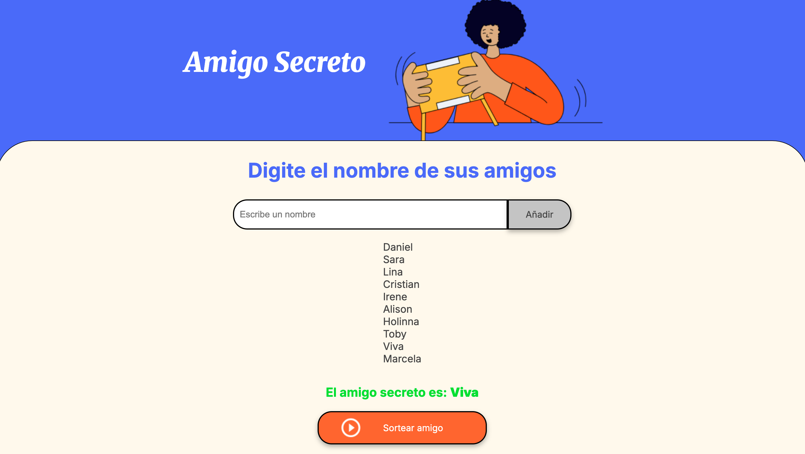

# challenge-amigo-secreto

Este challenge es desarrollado para poner en práctica conocimientos de **HTML, CSS y JavaScript**.

## Descripción del challenge

En este challenge se desarrollara una aplicación web que permite a los usuarios **ingresar nombres de amigos** en una lista y luego realizar un **sorteo aleatorio** para determinar quién será el "amigo secreto".

El flujo de la aplicacion es sencillo y divertido:

1. Los usuarios escriben un nombre en un campo de texto.
2. Con el botón **"Adicionar"**, agregan el nombre a una lista visible en la pantalla.
3. Una vez registrados todos los participantes, con el botón **"Sortear amigo "**, la aplicación selecciona al azar un nombre y lo muestra en la página.

## Nota

- Asegurate de agregar al menos un nombre antes de realizar el sorteo.
- Si intentas sortear sin nomnbres, la aplicación mostrará una alerta.

## Funcionalidades

- **Agregar nombres**: Permite a los usuarios ingresar nombres en un campo de texto y añadirlos a la lista con el botón "Adicionar".
- **Validar entrada**: Si el campo de texto está vacío, la aplicación muestra una alerta solicitando un nombre válido.
- **Visualizar la lista**: Todos los nombres ingresados se muestran en una lista debajo del campo de entrada.
- **Sorteo aleatorio**: Con el botón "Sortear amigo", se selecciona aleatoreamente un nombre y se muestra como resultado en pantalla.

## Tecnologías utilizadas

- **HTML5** para la estructura de la aplicación.
- **CSS3** para el diseño y estilos.
- **JavaScript** para la lógica del juego.

## Capturas de pantalla

### Pantalla principal


### Agregar nombre


### Lista con nombres agregados 


### Sortear amigo secreto 


## Instalación y uso

Sigue estos pasos para clonar y ejecutar el proyecto en tu computadora:

1. **Clona el repositorio** o descarga el proyecto:

```bash
git clone https://github.com/AshKenaz-create/challenge-amigo-secreto.git
```
2. **Accede a la carpeta del proyecto**:

```bash
cd challenge-amigo-secretp
```

3. **Abre el archivo index.html en tu navegador favorito**:
- Puedes hacerlo con doble clic desde el explorador de archivos.
- Usar un servidor local (opcional) para una mejor experiencia.
